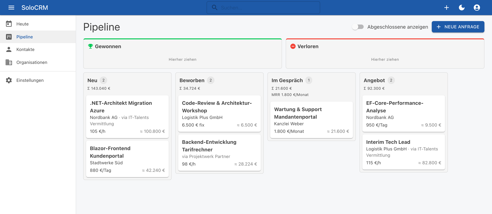
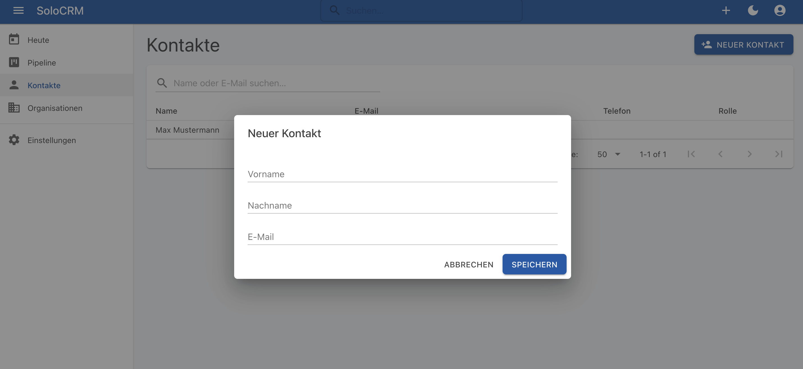

# SoloCRM

[](https://github.com/guido-altmann/solocrm/actions/workflows/build-test.yml)
[](https://github.com/guido-altmann/solocrm/actions/workflows/docker.yml)

Schlankes, selbst gehostetes CRM für Freelancer und Einzelunternehmer: Kontakte, Organisationen (Endkunden & Vermittler), Projektanfragen-Pipeline, Timeline und Follow-ups. Entstanden für den Eigenbedarf und als Lern- und Referenzprojekt für eine saubere .NET-Architektur (Vertical Slices, EF-Core-Interceptors, Outbox).

**Stack:** .NET 10 · Blazor (Interactive Server) · MudBlazor · PostgreSQL · EF Core · Docker/Coolify



## Stand
- **Iteration 1 (Walking Skeleton):** Login (Single-User), CI auf GitHub Actions, Image in GHCR, Deployment auf Coolify mit HTTPS, persistenten Data-Protection-Keys und S3-Backups.
- **Iteration 2 (Kerndomäne):** Organisationen (Endkunde, Vermittler, Partner) und Kontakte mit Firmenzuordnung, Filtern, Sortierung und Archivierung; Projektanfragen mit Preismodell (Stunden-/Tagessatz, Festpreis, Retainer), Laufzeit und live berechnetem Wert; Pipeline-Board mit Drag & Drop, Won/Lost inklusive Absagegrund; Phasen in den Einstellungen verwalten. Jede Änderung wird per EF-Interceptor auditiert, Domain Events landen transaktional in der Outbox.

Weitere Funktionen (Timeline, Tasks, Heute-Ansicht, Suche, API/Webhooks) folgen gemäß [Iterationsplan](docs/SPEC.md#8-iterationsplan).

<details>
<summary>Kontaktliste mit Quick-Add (Iteration 1)</summary>


</details>

## Quickstart (lokal)
Voraussetzungen: .NET SDK 10 (siehe `global.json`), Docker.

```bash
# 1. Postgres starten
docker compose -f deploy/docker-compose.dev.yml up -d

# 2. Datenbank migrieren (dotnet-ef ist als lokales Tool gepinnt)
dotnet tool restore
dotnet ef database update -p src/SoloCrm.Infrastructure -s src/SoloCrm.Web

# 3. Admin-Zugang festlegen (wird beim ersten Start angelegt)
dotnet user-secrets set "Admin:Email" "you@example.com" --project src/SoloCrm.Web
dotnet user-secrets set "Admin:InitialPassword" "<secure>" --project src/SoloCrm.Web

# 4. App starten → http://localhost:5045
dotnet watch --project src/SoloCrm.Web
```

## Tests
```bash
dotnet test                                            # alle Tests (Integrationstests brauchen Docker)
dotnet test --filter-not-trait "Category=Integration"  # schnell, ohne Docker
```

## Container
```bash
docker build -t solocrm:local .
```
Das Image führt beim Start zuerst die Migrationen aus (`efbundle`) und startet dann die App auf Port 8080. Betrieb auf Coolify: [deploy/coolify.md](deploy/coolify.md).

## Dokumentation
- [Spezifikation](docs/SPEC.md)
- [Architekturentscheidungen (ADRs)](docs/adr/README.md)
- [Iterationen](docs/iterations/)
- [Deployment auf Coolify](deploy/coolify.md)
- [Hinweise für Claude Code](CLAUDE.md)
