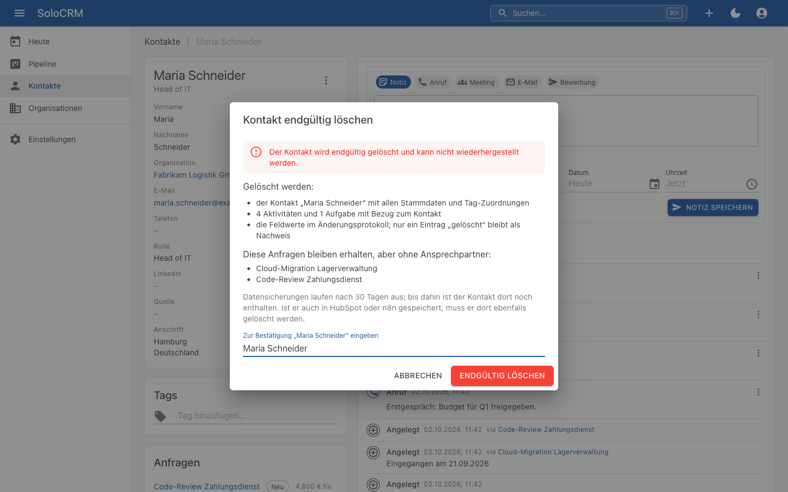
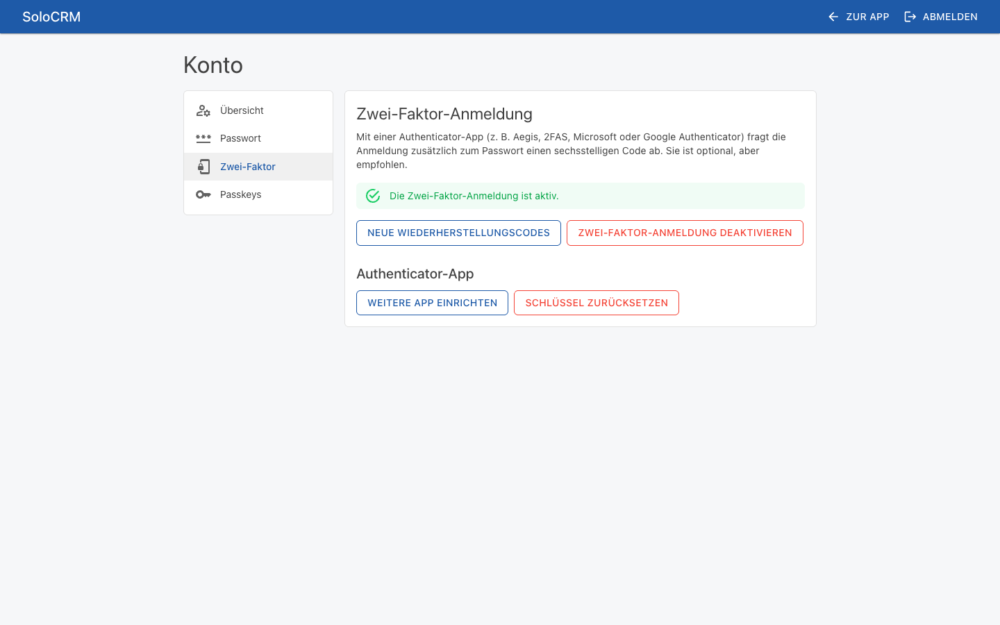
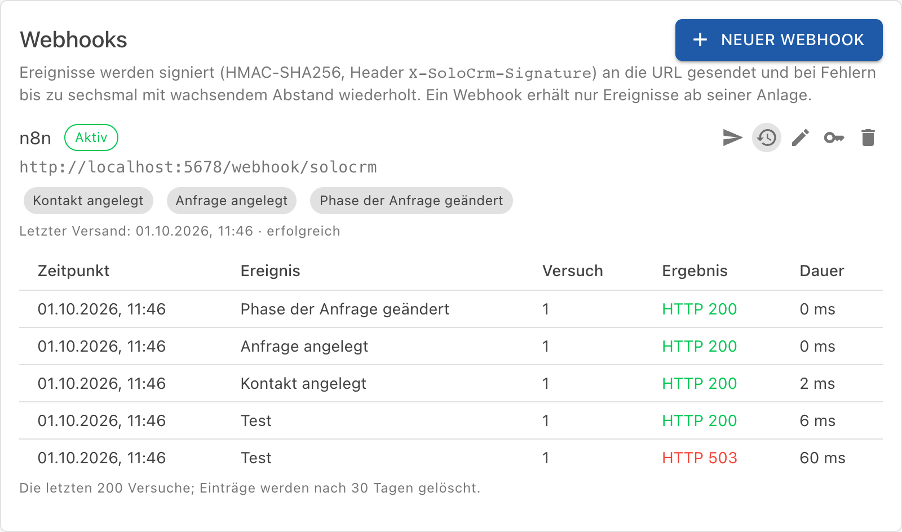
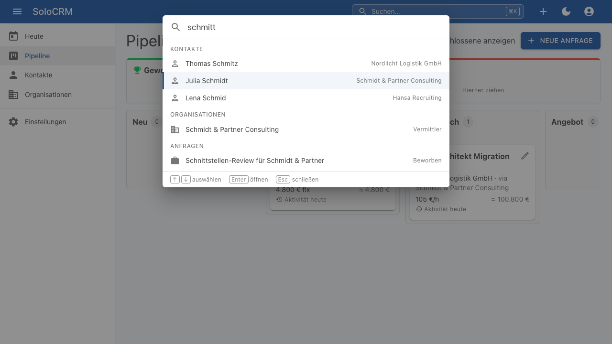
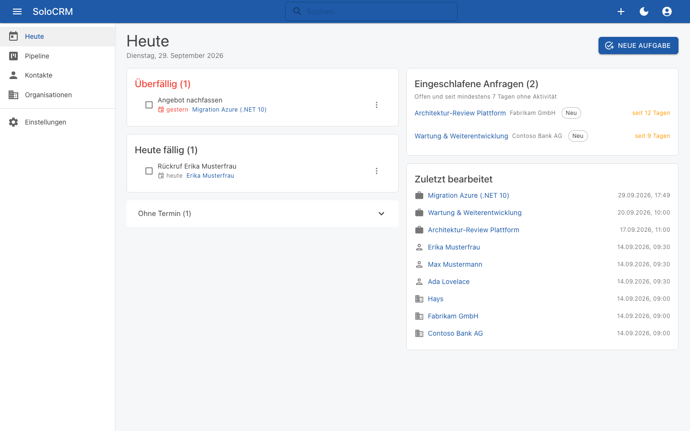
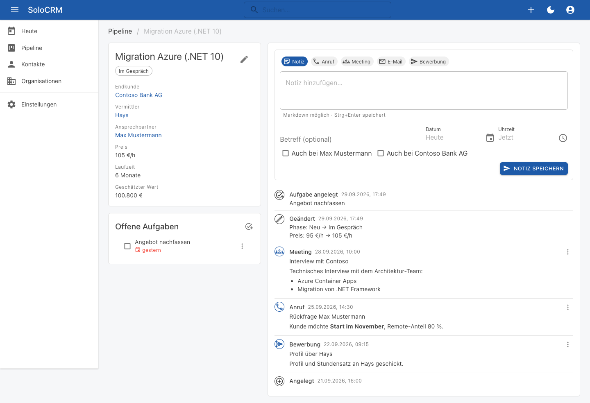

# SoloCRM

[](https://github.com/guido-altmann/solocrm/actions/workflows/build-test.yml)
[](https://github.com/guido-altmann/solocrm/actions/workflows/docker.yml)

Schlankes, selbst gehostetes CRM für Freelancer und Einzelunternehmer: Kontakte, Organisationen (Endkunden & Vermittler), Projektanfragen-Pipeline, Timeline und Follow-ups. Entstanden für den Eigenbedarf und als Lern- und Referenzprojekt für eine saubere .NET-Architektur (Vertical Slices, EF-Core-Interceptors, Outbox).

**Stack:** .NET 10 · Blazor (Interactive Server) · MudBlazor · PostgreSQL · EF Core · Docker/Coolify


## Funktionen (MVP)
- **Kontakte und Organisationen** mit Typ (Endkunde, Vermittler, Partner), Anschrift, Tags, Archivierung und CSV-Import (Vorlagen für HubSpot-Exporte)
- **Projektanfragen** mit Preismodell (Stunden-/Tagessatz, Festpreis, Retainer), Laufzeit, live berechnetem Wert und Eingangsdatum für nachträglich erfasste Anfragen; **Pipeline** per Drag & Drop mit Summen je Phase
- **Timeline** je Kontakt, Organisation und Anfrage: Notizen, Anrufe, Meetings, E-Mails, Bewerbungen, Aufgaben und lesbare Änderungen; Ansicht **Heute** mit fälligen Aufgaben und eingeschlafenen Anfragen
- **Command Palette** (`Ctrl/Cmd + K`) mit tippfehlertoleranter Suche, Tastenkürzel, Inline-Bearbeitung
- **Integration:** REST-API mit API-Keys, signierte Webhooks über eine transaktionale Outbox, Beispiel-Workflows für n8n
- **Datenschutz:** DSGVO-Auskunft als JSON und endgültige Löschung mit anonymisiertem Änderungsprotokoll; Zwei-Faktor-Anmeldung per Authenticator-App und Passkeys

## Stand
- **Iteration 1 (Walking Skeleton):** Login (Single-User), CI auf GitHub Actions, Image in GHCR, Deployment auf Coolify mit HTTPS, persistenten Data-Protection-Keys und S3-Backups.
- **Iteration 2 (Kerndomäne):** Organisationen (Endkunde, Vermittler, Partner) und Kontakte mit Firmenzuordnung, Filtern, Sortierung und Archivierung; Projektanfragen mit Preismodell (Stunden-/Tagessatz, Festpreis, Retainer), Laufzeit und live berechnetem Wert; Pipeline-Board mit Drag & Drop, Won/Lost inklusive Absagegrund; Phasen in den Einstellungen verwalten. Jede Änderung wird per EF-Interceptor auditiert, Domain Events landen transaktional in der Outbox.
- **Iteration 3 (Timeline & Tasks):** Detailansichten für Kontakte, Organisationen und Anfragen mit einer chronologischen Timeline aus Activities (Notiz, Anruf, Meeting, E-Mail, Bewerbung; Markdown, rückdatierbar), Tasks und lesbaren Änderungen („Phase: Beworben → Im Gespräch“, „Preis: 95 €/h → 105 €/h“). Organisationen sehen auch die Einträge ihrer Kontakte und Anfragen („via …“). Follow-up-Tasks lassen sich per Checkbox erledigen, mit „Rückgängig“ für 5 Sekunden. Die Ansicht „Heute“ zeigt überfällige und heute fällige Aufgaben, eingeschlafene Anfragen und zuletzt Bearbeitetes. Preis-Defaults und der Schwellwert für „eingeschlafen“ sind in den Einstellungen pflegbar.

- **Iteration 4 (Suche & Komfort):** Command Palette (`Ctrl/Cmd + K`) mit tippfehlertoleranter Suche über Kontakte (inkl. E-Mail und Firma), Organisationen und Anfragen – PostgreSQL-Volltext plus `pg_trgm`, „Schmitt“ findet „Schmidt“ – sowie Aktionen wie „Neuer Kontakt“ oder „Gehe zu Pipeline“. Dieselbe Suche steckt in Listen und Autocompletes. Tastenkürzel `G` + `H/P/K/O` und eine Übersicht per `?`. Stammdaten werden direkt in der Detailansicht bearbeitet (Enter/Blur speichert, Esc bricht ab, Fehler am Feld). Farbige Tags für Kontakte, Organisationen und Anfragen, inline anlegbar, filterbar und in den Einstellungen verwaltbar.

- **Iteration 5 (Integration):** Domain Events gehen über die Outbox als signierte Webhooks raus (HMAC-SHA256 mit Zeitstempel, Retry mit Backoff bis zu sechsmal, Versandprotokoll in den Einstellungen). Den Hintergrunddienst können zwei Container gleichzeitig betreiben, ohne doppelt zuzustellen (`FOR UPDATE SKIP LOCKED`). Dazu kommt eine REST-API unter `/api/v1` mit API-Keys (nur gehasht gespeichert, 60 Anfragen pro Minute), Problem Details, JSON Merge Patch und OpenAPI/Scalar. Kontakte und Organisationen lassen sich per CSV importieren, mit Vorschau, Spalten-Mapping, Vorlagen für die HubSpot-Exporte, Dublettenprüfung und Bericht je Zeile; importierte Kontakte werden über die HubSpot-Firmen-ID mit ihrer Organisation verknüpft. Kontakte und Organisationen haben eine vollständige Anschrift mit Länderauswahl. Beispiel-Workflows für n8n: [docs/n8n-integration.md](docs/n8n-integration.md).

- **Iteration 6 (DSGVO & Politur):** DSGVO-Auskunft je Kontakt als JSON-Download (auch per API) und endgültige Löschung nach Eingabe des Namens: Activities und Aufgaben werden mitgelöscht, Anfragen bleiben ohne Ansprechpartner, und im Änderungsprotokoll bleibt nur ein Nachweis ohne Feldwerte; ein Webhook `contact.deleted` meldet die Löschung weiter. Zwei-Faktor-Anmeldung mit QR-Code für die Authenticator-App, Wiederherstellungscodes und Passkeys; alle Kontoseiten auf Deutsch im Stil der App. Anfragen haben ein Eingangsdatum, damit nachträglich erfasste Anfragen richtig einsortiert werden. Dazu die Sicherung der Data-Protection-Keys und eine [Datenschutz-Doku](docs/datenschutz.md).

Damit ist das MVP abgeschlossen. Ideen für danach (u. a. Datenanreicherung, Dashboard, Nextcloud-Synchronisation) stehen im [Backlog](docs/SPEC.md#8-iterationsplan).











<details>
<summary>Detailansicht einer Anfrage mit Timeline (Iteration 3)</summary>


</details>

<details>
<summary>Kontaktliste mit Quick-Add (Iteration 1)</summary>


</details>

## Quickstart (lokal)
Voraussetzungen: .NET SDK 10 (siehe `global.json`), Docker.

```bash
# 1. Postgres starten
docker compose -f deploy/docker-compose.dev.yml up -d

# 2. Tools wiederherstellen (dotnet-ef ist als lokales Tool gepinnt).
#    Die Datenbank migriert die App im Development-Modus beim Start selbst.
dotnet tool restore

# 3. Admin-Zugang festlegen (wird beim ersten Start angelegt)
dotnet user-secrets set "Admin:Email" "you@example.com" --project src/SoloCrm.Web
dotnet user-secrets set "Admin:InitialPassword" "<secure>" --project src/SoloCrm.Web

# 4. App starten → http://localhost:5045
dotnet watch --project src/SoloCrm.Web
```

## Tests
```bash
dotnet test                                            # alle Tests (Integrationstests brauchen Docker)
dotnet test --filter-not-trait "Category=Integration"  # schnell, ohne Docker

# Testabdeckung von Domain und Application (Cobertura je Testprojekt, zusammengefasst als Tabelle)
dotnet test --coverage --coverage-output-format cobertura --coverage-settings tests/coverage.config --results-directory TestResults
python3 tests/coverage-summary.py TestResults/*.cobertura.xml
```

**Testabdeckung (Stand MVP, Zeilen):** Domain 99,6 %, Application 98,5 %. Die CI misst sie bei jedem Lauf und zeigt sie in der Zusammenfassung des Workflows *Build & Test*; ein Mindestwert wird noch nicht erzwungen.

## Container
```bash
docker build -t solocrm:local .
```
Das Image führt beim Start zuerst die Migrationen aus (`efbundle`) und startet dann die App auf Port 8080. Betrieb auf Coolify: [deploy/coolify.md](deploy/coolify.md).

## Dokumentation
- [Spezifikation](docs/SPEC.md)
- [Architekturentscheidungen (ADRs)](docs/adr/README.md)
- [Iterationen des MVP](docs/iterations/) (abgeschlossen); Backlog seitdem in Jira (Projekt `SOL`)
- [Deployment auf Coolify](deploy/coolify.md)
- [n8n-Integration (Webhooks, REST-API)](docs/n8n-integration.md)
- [Datenschutz (Auskunft, Löschung, Aufbewahrung)](docs/datenschutz.md)
- [Hinweise für Claude Code](CLAUDE.md)

## Lizenz
Copyright (C) 2026 Guido Altmann

SoloCRM steht unter der [GNU Affero General Public License v3.0 oder später](LICENSE) (`AGPL-3.0-or-later`). Wer modifizierte Versionen als Netzwerkdienst betreibt, muss den Quelltext seiner Version den Nutzern zur Verfügung stellen. Begründung: [ADR-012](docs/adr/0012-lizenz-agpl-3.md).
