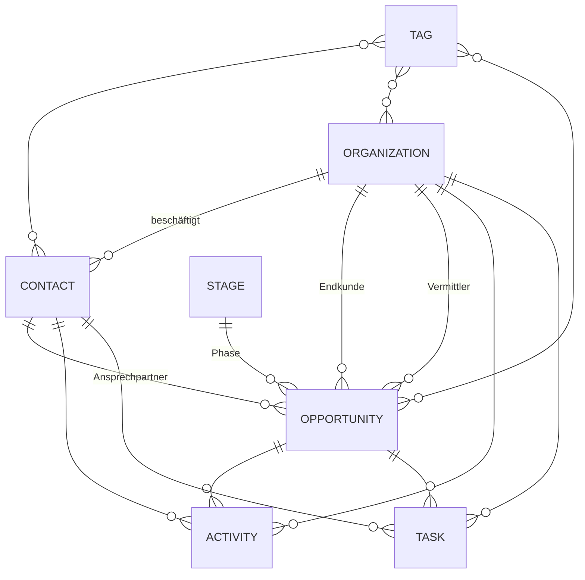

# SoloCRM – Spezifikation

> **Arbeitstitel:** SoloCRM (frei umbenennbar; Namespace-Präfix `SoloCrm`)
> **Status:** Entwurf v0.16 · **Stand:** 2026-10-01 · **Owner:** Guido Altmann

Dieses Dokument ist die fachliche und technische Referenz für die Entwicklung. Architekturentscheidungen stehen ausführlich in `docs/adr/`, Arbeitsanweisungen für Claude Code in `/CLAUDE.md`, konkrete Iterationsaufträge in `docs/iterations/`.

---

## 1. Vision & Scope

### 1.1 Vision
Ein schlankes, selbst gehostetes CRM für Einzelunternehmer und Freelancer. Es bündelt alle Kontakte, Projektanfragen und Follow-ups an einem Ort und ist ohne Schulung bedienbar.

### 1.2 Zweck des Projekts
1. **Eigenbedarf:** Das CRM ersetzt die bisherige Lösung (HubSpot Free / Notizen) im Tagesgeschäft.
2. **Lernprojekt:** Die zentralen CRM-Mechaniken (Timeline, Audit, Suche, Outbox/Webhooks) werden bewusst selbst implementiert und verstanden.
3. **Referenzprojekt:** Das Repository ist öffentlich zeigbar. Dazu gehören saubere Architektur, ADRs, Tests, CI/CD und README.

### 1.3 Ziele
- **Z1:** Kein Follow-up geht verloren. Die Ansicht „Heute“ zeigt täglich alles Fällige.
- **Z2:** Die Pipeline mit offenen Anfragen, Phasen und Potenzial ist auf einen Blick sichtbar.
- **Z3:** Pro Kontakt, Organisation und Anfrage gibt es eine vollständige, chronologische Historie.
- **Z4:** Das System ist über REST-API und Webhooks automatisierbar, z. B. mit n8n.
- **Z5:** Die Bedienung ist maximal einfach: Quick-Add, Command Palette, Inline-Editing.

### 1.4 Nicht-Ziele (bewusst ausgeschlossen)
- Multi-Tenancy, Teams, Rollen- und Rechtemodell
- Marketing-Automation, Newsletter, Kampagnen
- Rechnungsstellung und Buchhaltung
- Native Mobile App (responsive Web reicht)
- Frei konfigurierbare Objekttypen oder mehrere Pipelines
- Mehrsprachige UI (die UI ist Deutsch; Code und Bezeichner sind Englisch)

### 1.5 Erfolgskriterien
- Ein neuer Kontakt mit Notiz ist in **< 30 Sekunden** erfasst.
- Typische Listen- und Suchabfragen dauern **< 200 ms** bei 10.000 Kontakten.
- Das CRM ist **im täglichen Einsatz**, und die bisherige Lösung ist abgelöst.
- Das Repo enthält README, ADRs, grüne CI mit Unit- und Integrationstests und ein reproduzierbares Deployment.

---

## 2. Fachliches Domänenmodell

### 2.1 Überblick



**Kernidee:** Die Domäne bildet den Freelancer-Alltag ab. Es gibt **Endkunden** und **Vermittler** (Agenturen, Personaldienstleister). Ein „Deal“ ist eine **Projektanfrage oder ein Angebot** mit flexiblem Preismodell (Stundensatz, Tagessatz, Festpreis oder monatlicher Retainer), Laufzeit und Remote-Anteil. Beziehungen sind **typisiert** und nicht generisch (siehe ADR-005).

### 2.2 Gemeinsame Konventionen für alle Entitäten
| Feld | Typ | Regel |
|---|---|---|
| `Id` | `Guid` | UUIDv7 (`Guid.CreateVersion7()`), zeitlich sortierbar |
| `CreatedAt`, `UpdatedAt` | `DateTimeOffset` | UTC, gesetzt durch EF-Interceptor |
| `IsArchived` | `bool` | Weiches Ausblenden (kein Löschen); nur bei Contact, Organization, Opportunity |
| `ExtraFields` | `jsonb` | Optionale Zusatzfelder (Key/Value); Vorstufe späterer Custom Properties |

**Löschen:** Archivieren ist der Normalfall. Hartes Löschen gibt es nur explizit, z. B. bei einem DSGVO-Löschwunsch (siehe US-20).

### 2.3 Entitäten

#### Organization
| Feld | Typ | Pflicht | Hinweis |
|---|---|---|---|
| Name | string(200) | ✅ | |
| Type | enum `OrganizationType` | ✅ | `Client`, `Agency`, `Partner`, `Other`; Default: `Other` |
| Website | string(500) | | URL-Validierung |
| Address | Value Object `Address`? | | Anschrift, siehe unten; `Address.City` ersetzt das frühere Feld `City` (Spalte `city`) |
| Notes | text | | Freitext-Stammnotiz (Verlauf läuft über Activities) |

#### Contact
| Feld | Typ | Pflicht | Hinweis |
|---|---|---|---|
| FirstName | string(100) | | |
| LastName | string(100) | ✅* | *mindestens FirstName **oder** LastName |
| Email | string(320) | | eindeutig (case-insensitive), falls gesetzt |
| Phone | string(50) | | |
| JobTitle | string(150) | | Rolle, z. B. „Recruiterin“, „CTO“ |
| LinkedInUrl | string(500) | | |
| OrganizationId | Guid? | | Kontakt ohne Organisation erlaubt |
| Source | enum `LeadSource` | | `LinkedIn`, `ProjectPortal`, `Referral`, `Website`, `Event`, `Other` |
| Address | Value Object `Address`? | | Anschrift, siehe unten |

**Value Object `Address`** (EF Core Complex Type wie `Pricing`, ADR-011; `null`, wenn alle Felder leer sind)
| Feld | Typ | Hinweis |
|---|---|---|
| Street | string(200)? | Straße inkl. Hausnummer |
| Street2 | string(200)? | Adresszusatz (c/o, Gebäude, Postfach) |
| PostalCode | string(20)? | ohne Formatprüfung (international) |
| City | string(100)? | |
| Region | string(100)? | Bundesland, Kanton, State |
| CountryCode | string(2)? | ISO 3166-1 Alpha-2 (`DE`, `AT`, `CH` …); Anzeige und Auswahl mit deutschem Namen aus fester Liste |

#### Opportunity (Projektanfrage / Angebot)
| Feld | Typ | Pflicht | Hinweis |
|---|---|---|---|
| Title | string(200) | ✅ | z. B. „.NET-Architekt Migration Azure“ |
| StageId | Guid | ✅ | Default: erste offene Stage |
| ClientOrganizationId | Guid? | | Endkunde (kann anfangs unbekannt sein) |
| AgencyOrganizationId | Guid? | | Vermittler (optional) |
| PrimaryContactId | Guid? | | Ansprechpartner |
| **Pricing** | Value Object `Pricing`? | | Preismodell + Betrag, siehe unten |
| StartDate | DateOnly? | | |
| **Duration** | Value Object `Duration`? | | Laufzeit mit Einheit, siehe unten |
| Utilization | int? | | Auslastung in % (0–100); nur relevant für Stunden-/Tagessatz |
| RemotePercentage | int? | | 0–100 |
| Source | enum `LeadSource` | | |
| LostReason | enum `LostReason`? | | nur bei Stage-Status `Lost`: `Price`, `Timing`, `OtherCandidate`, `ProjectCancelled`, `NoResponse`, `DeclinedByMe`, `Other` |
| ClosedAt | DateTimeOffset? | | gesetzt beim Wechsel auf `Won` / `Lost`; beim Wiedereröffnen (Wechsel zurück auf eine offene Stage) werden `ClosedAt` und `LostReason` geleert |

**Value Object `Pricing`** (EF Core Complex Type, siehe ADR-011)
| Feld | Typ | Hinweis |
|---|---|---|
| Model | enum `PricingModel` | `Hourly` (**Default**), `Daily`, `FixedPrice`, `Retainer` |
| Amount | decimal(12,2) | Bedeutung abhängig vom Modell (siehe Tabelle) |
| Currency | string(3) | ISO 4217, Default `EUR` |

| PricingModel | Bedeutung von `Amount` | Anzeige (Beispiel) |
|---|---|---|
| `Hourly` | Stundensatz | 95 €/h |
| `Daily` | Tagessatz | 760 €/Tag |
| `FixedPrice` | Gesamtpreis | 8.000 € fix |
| `Retainer` | Monatlicher Betrag | 2.500 €/Monat |

**Value Object `Duration`** (EF Core Complex Type)
| Feld | Typ | Hinweis |
|---|---|---|
| Value | int | > 0 |
| Unit | enum `DurationUnit` | `Days`, `Weeks`, `Months` |

`Duration = null` bedeutet „offen / unbefristet“.

**Abgeleiteter Wert `EstimatedValue`** (nur berechnet, nicht gespeichert; Domain-Methode, vollständig unit-getestet):

Umrechnung der Laufzeit in Arbeitstage bzw. Monate:
- `Days` → *Value* Arbeitstage
- `Weeks` → *Value* × 5 Arbeitstage
- `Months` → *Value* × 20 Arbeitstage bzw. *Value* Monate
- Für Retainer bei Angabe in Tagen/Wochen: Monate = Arbeitstage / 20, auf ganze Monate aufgerundet.

| PricingModel | Formel | Fehlende Angaben |
|---|---|---|
| `Hourly` | Amount × `HoursPerDay` × Arbeitstage × Utilization/100 | Utilization fehlt → 100 %; Duration fehlt → `null` |
| `Daily` | Amount × Arbeitstage × Utilization/100 | wie Hourly |
| `FixedPrice` | Amount | unabhängig von der Laufzeit |
| `Retainer` | Amount × Monate | Duration fehlt → Amount × `RetainerValuationMonths` |

Einstellungen (Settings, mit Defaults): `HoursPerDay` = 8, `RetainerValuationMonths` = 12, `DefaultCurrency` = EUR, `DefaultPricingModel` = Hourly.
Zusätzlich wird für Retainer der **monatlich wiederkehrende Umsatz (MRR)** separat ausgewiesen (Pipeline-Summen, später Dashboard).

#### Stage
| Feld | Typ | Hinweis |
|---|---|---|
| Name | string(100) | |
| SortOrder | int | |
| Status | enum `StageStatus` | `Open`, `Won`, `Lost` |

**Seed-Daten:** Neu (Open) → Beworben (Open) → Im Gespräch (Open) → Angebot (Open) → Gewonnen (Won) → Verloren (Lost).
Es muss immer mindestens je eine Stage mit `Won` und mit `Lost` existieren, außerdem mindestens eine offene Stage (sonst lassen sich keine Anfragen anlegen).
Beim Löschen einer Stage mit zugeordneten Anfragen muss die Ziel-Stage denselben Status haben; die Anfragen werden einzeln über den Stage-Wechsel umgehängt (Audit und Event je Anfrage).

#### Activity
| Feld | Typ | Hinweis |
|---|---|---|
| Type | enum `ActivityType` | `Note`, `Call`, `Meeting`, `Email`, `ApplicationSent` |
| OccurredAt | DateTimeOffset | Default: jetzt; rückdatierbar, nicht in der Zukunft (5 min Toleranz) |
| Subject | string(200)? | |
| Body | text | Pflicht; Markdown erlaubt (gerendert mit Markdig, ohne Roh-HTML; Links nur http(s)/mailto) |
| ContactId / OrganizationId / OpportunityId | Guid? | **mindestens einer** gesetzt |

Activities lassen sich bearbeiten (Art, Zeitpunkt, Betreff, Text; die Bezüge bleiben unverändert) und hart löschen (das Löschen wird als AuditEntry `Deleted` protokolliert); ein Archivieren gibt es nicht. Wird ein Bezugsobjekt hart gelöscht, werden seine Activities mitgelöscht (`ON DELETE CASCADE`, Vorbereitung für US-20).

#### TaskItem
(Der Name vermeidet die Kollision mit `System.Threading.Tasks.Task`.)
| Feld | Typ | Hinweis |
|---|---|---|
| Title | string(200) | ✅ |
| DueDate | DateOnly? | |
| CompletedAt | DateTimeOffset? | `null` = offen |
| ContactId / OrganizationId / OpportunityId | Guid? | optional (freie Tasks erlaubt) |

Titel und Fälligkeit sind bearbeitbar; Tasks lassen sich hart löschen (AuditEntry `Deleted`). Beim harten Löschen eines Kontakts werden seine Tasks mitgelöscht (US-20); bei Organisation und Anfrage wird der Bezug geleert.

#### Tag
| Feld | Typ | Hinweis |
|---|---|---|
| Name | citext(50) | ✅ eindeutig (case-insensitive); Leerraum wird normalisiert („ Kunde   A “ → „Kunde A“) |
| Color | string(7) | Hex aus einer festen Palette von 12 Farben; weiße Schrift hat auf jeder Farbe einen Kontrast ≥ 4,5:1 (hell und dunkel); neue Tags bekommen reihum die Farbe nach der des zuletzt angelegten Tags |

n:m-Beziehungen zu Contact, Organization und Opportunity über drei typisierte Join-Tabellen (`contact_tags`, `organization_tags`, `opportunity_tags`, `ON DELETE CASCADE`). Neue Tags entstehen inline in der Chip-Eingabe („Neu anlegen: …“); ein Name, der sich nur in Groß-/Kleinschreibung unterscheidet, verwendet den bestehenden Tag. Zuordnungen werden als `Updated` des Datensatzes mit dem Feld `Tags` auditiert (alter bzw. neuer Wert = Tag-Name), erscheinen aber nicht in der Timeline (2.5). Beim Löschen eines Tags werden seine Zuordnungen einzeln entfernt, sodass jeder betroffene Datensatz seinen AuditEntry erhält.

### 2.4 Technische / unterstützende Entitäten
| Entität | Zweck | Felder (Kern) |
|---|---|---|
| **AuditEntry** | Änderungshistorie → Timeline | EntityType, EntityId, Action (`Created`/`Updated`/`Deleted`/`Archived`), Changes (jsonb: `[{field, old, new}]`), OccurredAt |
| **OutboxMessage** | Zuverlässiger Event-Versand (Webhooks) | Type, Payload (jsonb), OccurredAt, ProcessedAt?, Attempts, NextAttemptAt, LastError |
| **WebhookSubscription** | Ziel-URLs für Events | Name, Url, Events (text[]), ProtectedSecret (per Data Protection verschlüsselt), IsActive |
| **WebhookDelivery** | Versandprotokoll (30 Tage) | SubscriptionId, EventId (= Outbox-Id bzw. Id des Test-Pings, kein FK), EventType, Attempt, StatusCode?, DurationMs, Error?, AttemptedAt, Succeeded |
| **AppSetting** | Anwenderseitige Einstellungen (Key/Value, typisiert gelesen über `IAppSettings`) | Key, Value (jsonb), UpdatedAt – z. B. `HoursPerDay`, `RetainerValuationMonths`, `DefaultPricingModel`, `DefaultCurrency`, `StaleOpportunityDays` |
| **ApiKey** | Zugriff auf die REST-API | Name, Prefix (8 zufällige Zeichen, Key-Format `scrm_<prefix>_<64 hex>`), KeyHash (SHA-256), CreatedAt, LastUsedAt? (höchstens minütlich aktualisiert), RevokedAt? |

### 2.5 Timeline-Regeln
Die Timeline eines Objekts ist ein chronologischer Strom, absteigend sortiert, aus:
1. Activities, die direkt auf das Objekt verweisen,
2. Tasks (angelegt / erledigt),
3. relevanten AuditEntries (Anlage, Stage-Wechsel, Änderung von Schlüsselfeldern). Die Anlage erscheint als „Angelegt“; in der aggregierten Organisations-Timeline nur für Anfragen, nicht für die Kontakte der Organisation.

**Aggregation:**
- **Organization-Timeline** enthält zusätzlich die Einträge ihrer Contacts und Opportunities (Kennzeichnung „via Max Mustermann“).
- **Opportunity-Timeline** enthält nur Einträge mit direktem Bezug.
- **Contact-Timeline** enthält direkte Einträge plus Einträge von Opportunities, bei denen der Kontakt `PrimaryContact` ist.
- Maßgeblich ist die **aktuelle** Zuordnung (z. B. heutige Kontakte einer Organisation). Ein Eintrag, der direkt und über das Umfeld verknüpft ist, erscheint nur einmal (ohne „via“).
- Die Timeline wird per Cursor geladen („Mehr laden“); Umsetzung und Konfiguration der sichtbaren Felder siehe ADR-006.

**Audit-Felder, die in der Timeline erscheinen:** Stage, Pricing (Modell/Betrag), Duration, OrganizationId (Kontakt wechselt Firma), IsArchived. Alle übrigen Änderungen werden auditiert, aber in der Timeline nicht angezeigt.

### 2.6 Domain Events
| Event | Auslöser | Konsumenten |
|---|---|---|
| `ContactCreated` | Anlage Contact | Outbox (Webhook) |
| `OrganizationCreated` | Anlage Organization | Outbox |
| `OpportunityCreated` | Anlage Opportunity | Outbox |
| `OpportunityStageChanged` | Stage-Wechsel | Outbox; setzt `ClosedAt` bei Won/Lost |
| `TaskCompleted` | Task erledigt | Outbox |
| `TaskReopened` | Erledigter Task wieder geöffnet (z. B. Undo) | Outbox |
| `ActivityLogged` | Activity erfasst | Outbox |

Events werden in der Entität gesammelt (`AddDomainEvent`) und **innerhalb derselben Transaktion** in die Outbox geschrieben (ADR-006, ADR-010).

---

## 3. UI & UX

### 3.1 Prinzipien
1. **Quick-Add überall:** Shortcut `N` oder Button → minimaler Dialog; nur der Name ist Pflicht.
2. **Command Palette** (`Ctrl/Cmd + K`): globale Suche + Aktionen („Neuer Kontakt“, „Gehe zu Pipeline“).
3. **Inline-Editing** in Detailansichten (Klick auf Feld → Bearbeiten → Enter/Blur speichert).
4. **Wenige Pflichtfelder:** optionale Felder sind eingeklappt bzw. erst nach Anlage sichtbar.
5. **Eine Timeline pro Objekt**, oben ein Eingabefeld „Notiz hinzufügen…“ mit Typ-Auswahl.
6. **Tastaturbedienbarkeit** für alle Kernaktionen.
7. **Konsistenz:** MudBlazor-Standardkomponenten, ein Theme, Hell-/Dunkelmodus.

### 3.2 Tastenkürzel
| Kürzel | Aktion |
|---|---|
| `Ctrl/Cmd + K` | Command Palette (auch in Eingabefeldern und Dialogen) |
| `N` | Quick-Add (kontextabhängig: Kontakt / Organisation / Anfrage / Notiz) |
| `G` dann `H` / `P` / `K` / `O` | Gehe zu Heute / Pipeline / Kontakte / Organisationen (zweite Taste innerhalb von 1 s) |
| `?` | Übersicht der Tastenkürzel (statischer Dialog) |
| `Esc` | Dialog oder Palette schließen / Inline-Edit abbrechen |
| `Enter` / `F2` | Stammdatenfeld in der Detailansicht bearbeiten; `Enter` (mehrzeilig `Ctrl/Cmd + Enter`) speichert |

Außer `Ctrl/Cmd + K` wirken die Kürzel nur außerhalb von Eingabefeldern und Dialogen. In der Command Palette wählen `↑`/`↓` einen Eintrag, `Enter` öffnet ihn.

### 3.3 Screens (MVP)
| # | Screen | Route | Inhalt |
|---|---|---|---|
| S1 | **Heute** | `/` | Überfällige Tasks (rot), heute fällige Tasks, „eingeschlafene“ Anfragen (offen, nicht archiviert, seit mindestens N Kalendertagen keine direkte Activity bzw. seit der Anlage, Default 7), zuletzt bearbeitet (max. 10, ohne Archivierte); eingeklappt: Tasks ohne Termin. „Heute“ und alle Tagesgrenzen gelten in der konfigurierten Zeitzone (`App__TimeZone`, Default `Europe/Berlin`) |
| S2 | **Pipeline** | `/pipeline` | Kanban je offener Stage; Karten mit Titel, Endkunde/Vermittler, Preis im Modellformat (z. B. „95 €/h“, „2.500 €/Monat“), Tags, Tage seit letzter Activity (Definition wie S1); Klick öffnet die Detailansicht; Drag & Drop; je Spalte Summe `EstimatedValue` und – falls Retainer enthalten – Summe MRR; Won/Lost als Drop-Zonen |
| S3 | **Kontakte** | `/contacts` | Tabelle mit Suche (dieselbe tippfehlertolerante Suche wie die Command Palette), Filter (Organisation, Tags ODER-verknüpft, Quelle), Sortierung, Paging (serverseitig) |
| S4 | **Organisationen** | `/organizations` | analog S3, Filter nach Typ |
| S5 | **Detailansicht** | `/contacts/{id}`, `/organizations/{id}`, `/opportunities/{id}` | Links Stammdaten (inline editierbar ab It. 4; ersetzt dort den Bearbeiten-Dialog; bei Anfragen Preis und Laufzeit als Gruppe mit Live-Wert, Wechsel auf „Verloren“ fragt den Absagegrund ab; Archivieren im Kopf), Tags als Chip-Eingabe, verknüpfte Objekte, offene Tasks; rechts die Timeline mit Eingabe; `N` fokussiert die Eingabe |
| S6 | **Einstellungen** | `/settings` | Stages (Reihenfolge, Name), Tags, Preis-Defaults (Modell, Währung, Stunden/Tag, Retainer-Bewertungszeitraum), API-Keys, Webhooks, Import, Konto (Passwort, 2FA) |

### 3.4 Layout
- Linke Navigation (einklappbar): Heute, Pipeline, Kontakte, Organisationen, Einstellungen
- Obere Leiste: Suchfeld (öffnet per Klick oder `Enter` die Command Palette; bewusst nicht schon beim Fokus, damit Tab-Navigation keinen Dialog öffnet, WCAG 3.2.1), Quick-Add-Button, Theme-Toggle
- Responsive: Unter 960 px wird die Navigation zum Drawer und die Detailansicht einspaltig.

---

## 4. User Stories (MVP)

Format: **US-xx** · Story · Akzeptanzkriterien (AK) · Iteration

### Kontakte & Organisationen
**US-01 · Kontakt per Quick-Add anlegen** · It. 1
- AK1: Pflicht ist nur Vor- oder Nachname.
- AK2: Nach dem Speichern ist der Kontakt sofort in Liste und Suche auffindbar.
- AK3 (It. 2): Ein AuditEntry `Created` wird geschrieben (setzt den `AuditInterceptor` voraus).

**US-02 · Kontakt einer Organisation zuordnen** · It. 2
- AK1: Autocomplete auf bestehende Organisationen.
- AK2: „Neu anlegen: <Eingabe>“ erstellt die Organisation inline (Typ `Other`).

**US-03 · Organisation klassifizieren** · It. 2
- AK1: Typ ist wählbar (Endkunde / Vermittler / Partner / Sonstige).
- AK2: Die Liste ist nach Typ filterbar.

**US-04 · Kontakte und Organisationen durchsuchen, filtern, sortieren** · It. 2
- AK1: Serverseitiges Paging (Default 50).
- AK2: Filter nach Tag (mehrere, ODER-verknüpft), Quelle bzw. Typ.

**US-05 · Archivieren** · It. 2
- AK1: Archivierte Objekte verschwinden aus Listen und Suche; ein Filter „Archivierte anzeigen“ holt sie zurück.
- AK2: Wiederherstellen ist möglich.

### Anfragen & Pipeline
**US-06 · Projektanfrage erfassen** · It. 2
- AK1: Pflicht ist nur der Titel; Stage-Default ist die erste offene Stage.
- AK2: Endkunde und Vermittler werden getrennt gewählt; nur Organisationen passenden Typs werden vorgeschlagen, alle anderen bleiben auswählbar.
- AK3: Das Preismodell ist wählbar (Default: Stundensatz). Das Betragsfeld passt Label und Einheit dynamisch an („€/h“, „€/Tag“, „€ fix“, „€/Monat“); das Feld Auslastung erscheint nur bei Stunden- und Tagessatz.
- AK4: Die Laufzeit wird als Zahl + Einheit (Tage/Wochen/Monate) erfasst oder bleibt leer („offen“).
- AK5: Der geschätzte Wert (`EstimatedValue`) wird live angezeigt, sobald er berechenbar ist; bei Retainern zusätzlich der MRR.

**US-07 · Pipeline per Drag & Drop** · It. 2
- AK1: Ein Drop in eine andere Spalte ändert die Stage und schreibt einen AuditEntry sowie `OpportunityStageChanged`.
- AK2: Die Timeline zeigt „Phase: Beworben → Im Gespräch“.

**US-08 · Anfrage gewinnen oder verlieren** · It. 2
- AK1: Beim Wechsel auf `Lost` ist ein Absagegrund Pflicht (Dialog).
- AK2: `ClosedAt` wird gesetzt, und die Karte verlässt das aktive Board.
- AK3: Ein Filter „Abgeschlossene“ zeigt Won und Lost.

**US-09 · Stages verwalten** · It. 2
- AK1: Umbenennen und Umsortieren sind möglich.
- AK2: Eine Stage mit zugeordneten Anfragen lässt sich nur löschen, wenn eine Ziel-Stage für die Umverteilung gewählt wird.

### Timeline & Tasks
**US-10 · Activity erfassen** · It. 3
- AK1: Der Typ ist wählbar und `OccurredAt` rückdatierbar.
- AK2: Die Activity erscheint in allen Timelines gemäß 2.5.

**US-11 · Follow-up-Task anlegen und erledigen** · It. 3
- AK1: Anlage aus Detailansicht oder „Heute“.
- AK2: Erledigen per Checkbox; ein Undo-Snackbar erscheint für 5 s. Das Erledigen wird sofort gespeichert, „Rückgängig“ öffnet den Task wieder.

**US-12 · Heute-Ansicht** · It. 3
- AK1: Abschnitte: Überfällig, Heute, Eingeschlafene Anfragen, Zuletzt bearbeitet.
- AK2: Der Schwellwert für „eingeschlafen“ ist in den Einstellungen änderbar.

### Suche & Komfort
**US-13 · Command Palette** · It. 4
- AK1: `Ctrl/Cmd+K` öffnet sie; Treffer erscheinen nach ≤ 2 Zeichen.
- AK2: Die Suche umfasst Kontakte (Name, E-Mail, Firma), Organisationen und Anfragen (Titel).
- AK3: Tippfehlertoleranz über Trigram-Ähnlichkeit („Schmitt“ findet „Schmidt“).
- AK4: Pfeiltasten und Enter navigieren.

**US-14 · Inline-Editing** · It. 4
- AK1: Alle Stammdatenfelder der Detailansicht sind inline editierbar, mit Validierung und Fehlermeldung am Feld.

**US-15 · Tags** · It. 4
- AK1: Tags lassen sich bei Kontakten, Organisationen und Anfragen per Chip-Eingabe vergeben; neue Tags werden inline angelegt.

### Integration
**US-16 · CSV-Import** · It. 5
- AK1: Upload → Vorschau der ersten 10 Zeilen → Spalten-Mapping → Import.
- AK2: Dubletten werden per E-Mail erkannt (Optionen: überspringen / aktualisieren).
- AK3: Ein Ergebnisbericht zeigt angelegt, aktualisiert, übersprungen und fehlerhaft (mit Zeile und Grund).
- AK4: Eine Mapping-Vorlage für den HubSpot-Kontaktexport ist enthalten.
- AK5: Organisationen lassen sich ebenso importieren (Vorlage für den HubSpot-Firmenexport); beim anschließenden Kontakt-Import werden Kontakte über die HubSpot-Firmen-ID mit ihren Organisationen verknüpft.

**US-17 · REST-API mit API-Key** · It. 5
- AK1: Der Key wird in den Einstellungen erzeugt und nur einmal im Klartext angezeigt; gespeichert wird der Hash.
- AK2: Header `X-Api-Key`; Rate-Limit 60 Requests/Minute.
- AK3: OpenAPI-Dokument unter `/openapi/v1.json`, UI via Scalar.

**US-18 · Webhooks** · It. 5
- AK1: URL und Events sind wählbar; ein Secret wird generiert.
- AK2: Versand über die Outbox mit HMAC-SHA256-Signatur im Header `X-SoloCrm-Signature` (signiert wird `<timestamp>.<body>`, Zeitstempel im Header `X-SoloCrm-Timestamp`).
- AK3: Retry mit Exponential Backoff (max. 6 Versuche); das Protokoll ist in den Einstellungen sichtbar.

### Datenschutz & Konto
**US-19 · DSGVO-Auskunft** · It. 6
- AK1: Export eines Kontakts inklusive aller Activities, Tasks und AuditEntries als JSON.

**US-20 · DSGVO-Löschung** · It. 6
- AK1: Hartes Löschen des Kontakts inklusive Activities und Tasks mit direktem Bezug (nach Bestätigungsdialog).
- AK2: AuditEntries zum Kontakt werden anonymisiert (Changes geleert, Aktion `Deleted` bleibt).

**US-21 · Login & 2FA** · It. 1 (Login) / It. 6 (2FA)
- AK1: Ein einziger User, angelegt per Seed aus Umgebungsvariablen; keine Selbstregistrierung.
- AK2: TOTP-2FA ist optional aktivierbar.

---

## 5. REST-API

Basis: `/api/v1` · Auth: `X-Api-Key` · Format: JSON (camelCase, Enums als Namen wie `LinkedIn`, `Won`) · Fehler: RFC 9457 Problem Details · Referenz: OpenAPI unter `/openapi/v1.json`, Scalar unter `/scalar/v1` (beides nur mit Login)

| Methode | Pfad | Zweck |
|---|---|---|
| GET | `/contacts?search=&tag=&page=&pageSize=` | Liste |
| GET | `/contacts/{id}` | Detail (inkl. Tags) |
| POST | `/contacts` | Anlegen (typischer n8n-Lead-Eingang); `organizationName` nutzt eine bestehende Organisation gleichen Namens (case-insensitive) oder legt sie an |
| PATCH | `/contacts/{id}` | Teil-Update (JSON Merge Patch, RFC 7396: fehlendes Feld = unverändert, `null` = leeren) |
| GET/POST/PATCH | `/organizations…` | analog |
| GET/POST/PATCH | `/opportunities…` | analog, Liste zusätzlich mit `stageId`; `PATCH` mit `stageId` löst den Stage-Wechsel aus (Wechsel auf `Lost` verlangt `lostReason`) |
| POST | `/activities` | Activity erfassen (`type` Default `Note`, mindestens ein Bezug) |
| GET/POST/PATCH | `/tasks` (`GET`/`PATCH` mit `/{id}`) | Tasks; `PATCH` mit `completed: true/false` erledigt bzw. öffnet wieder |
| GET | `/stages` | Stages lesen |

**Anschrift:** Kontakte und Organisationen tragen die Adresse als flache Felder `street`, `street2`, `postalCode`, `city`, `region`, `countryCode` (ISO 3166-1 Alpha-2); im `PATCH` gilt Merge-Patch je Feld.

**Listen:** `page` beginnt bei 1, `pageSize` 1–200 (Default 50); Antwort `{ items, page, pageSize, totalCount }`. `search` ist dieselbe tippfehlertolerante Suche wie in der UI. `tag` (Name oder Id, mehrfach angebbar) filtert ODER-verknüpft; existiert keiner der Tags, ist die Liste leer. Archivierte Datensätze erscheinen nicht.

**Statuscodes:** `200`/`201` (mit `Location` und dem angelegten Datensatz), `400` Validierung (`errors` je Feld in camelCase; unbekannte Felder im `PATCH` sind ein Fehler), `401` ohne, mit ungültigem oder widerrufenem Key, `404` unbekannte Id oder unbekannter Endpunkt, `409` Konflikt (z. B. `Contact.DuplicateEmail`, `Opportunity.LostReasonRequired`), `422` übrige fachliche Fehler, `429` über 60 Anfragen pro Minute und Key (mit `Retry-After`). Fachliche Fehler tragen ihren Code in `code`.

Die Endpoints rufen dieselben Handler wie die UI; Validierung, Audit und Domain Events sind identisch. Beispiel-Workflows für n8n: `docs/n8n-integration.md`.

**Webhook-Payload (Beispiel):**
```json
{
  "id": "0192f6a0-...",
  "type": "opportunity.stage_changed",
  "occurredAt": "2026-10-01T09:12:44Z",
  "data": { "opportunityId": "…", "fromStageId": "…", "toStageId": "…", "toStageStatus": "Open" }
}
```

`data` enthält nur Ids und Status wie das Domain Event, keine personenbezogenen Inhalte; Details holt der Empfänger per REST-API. „Test senden“ schickt `webhook.ping` mit `data.subscriptionId`. Header: `X-SoloCrm-Event` (Typ), `X-SoloCrm-Timestamp` (Unix-Sekunden) und `X-SoloCrm-Signature: sha256=<hex>` = HMAC-SHA256 mit dem Subscription-Secret über `<timestamp>.<body>`. Empfänger prüfen Signatur und Alter (< 5 min) und deduplizieren über `id` (at-least-once). Eine Subscription erhält nur Events, die nach ihrer Anlage aufgetreten sind. `http`-Ziele nur für konfigurierte Hosts (`Webhooks__AllowedHttpHosts`), sonst `https`. OpenAPI-Dokument und Scalar-UI sind nur für den angemeldeten Nutzer erreichbar.

---

## 6. Nicht-funktionale Anforderungen

| Kategorie | Anforderung |
|---|---|
| Performance | Listen und Suche < 200 ms bei 10k Kontakten und 50k Activities; UI-Interaktion ohne spürbare Latenz |
| Verfügbarkeit | Single-Instance; Ausfallzeiten beim Deployment < 1 min tolerierbar |
| Backup | Tägliches Postgres-Backup über Coolify nach S3-kompatiblem Storage, 30 Tage Aufbewahrung; Restore einmal getestet und dokumentiert |
| Sicherheit | HTTPS only (HSTS); Cookies Secure/HttpOnly/SameSite=Lax; API-Keys nur gehasht gespeichert; Rate-Limiting auf API und Login; Antiforgery; optionale 2FA; Secrets ausschließlich über Umgebungsvariablen |
| Datenschutz | Hosting in der EU; Auskunft und Löschung (US-19/20); keine externen Tracker; Logs ohne personenbezogene Inhalte (keine Bodies, E-Mails nur maskiert) |
| Beobachtbarkeit | Strukturierte Logs (Serilog, JSON auf stdout); `/health/live` und `/health/ready` (inkl. DB-Check) |
| Wartbarkeit | Warnings as Errors; Nullable aktiviert; Analyzer; Testabdeckung der Domain- und Application-Schicht ≥ 80 % |
| Barrierearmut | Tastaturbedienbarkeit der Kernflüsse; ausreichende Kontraste (MudBlazor-Theme prüfen) |

---

## 7. Technische Architektur

### 7.1 Stack
| Bereich | Wahl |
|---|---|
| Runtime | .NET 10 (LTS) |
| UI | Blazor Web App, Render-Modus **Interactive Server** + MudBlazor |
| API | ASP.NET Core Minimal APIs, OpenAPI (`Microsoft.AspNetCore.OpenApi`) + Scalar |
| Persistenz | PostgreSQL 17 (oder aktuell), EF Core 10 + Npgsql, Extension `pg_trgm` |
| Auth | ASP.NET Core Identity (Cookie) für UI; API-Key-Handler für API |
| Background Jobs | eigener `BackgroundService` (Outbox, ADR-008); Hangfire erst bei weiteren Jobarten |
| Validierung | FluentValidation |
| Logging | Serilog (Console-JSON), optional Seq |
| CSV | CsvHelper |
| Markdown | Markdig (Activity-Body) |
| Tests | xUnit, AwesomeAssertions (oder Shouldly), Testcontainers.PostgreSql, bUnit, NSubstitute |
| CI/CD | GitHub Actions (Build, Test, Image-Build → GHCR), Deployment über Coolify |

### 7.2 Solution-Struktur
```
SoloCrm.sln
├─ src/
│  ├─ SoloCrm.Domain/            # Entitäten, Enums, Value Objects, Domain Events – keine Abhängigkeiten
│  ├─ SoloCrm.Application/       # Feature-Slices (Use Cases), Validierung, Abstraktionen (Interfaces)
│  │  └─ Features/
│  │     ├─ Contacts/            # CreateContact.cs, UpdateContact.cs, GetContacts.cs, …
│  │     ├─ Organizations/
│  │     ├─ Opportunities/
│  │     ├─ Pipeline/
│  │     ├─ Activities/
│  │     ├─ Tasks/
│  │     ├─ Timeline/
│  │     ├─ Search/
│  │     ├─ Import/
│  │     ├─ Webhooks/
│  │     └─ Privacy/
│  ├─ SoloCrm.Infrastructure/    # EF Core DbContext, Configurations, Migrations, Interceptors,
│  │                             # Outbox-Processor, Webhook-Sender, Suche
│  └─ SoloCrm.Web/               # Composition Root: Blazor-Komponenten, Minimal-API-Endpoints, Auth
│     ├─ Components/ (Layout, Pages, Shared)
│     └─ Endpoints/
├─ tests/
│  ├─ SoloCrm.Domain.Tests/
│  ├─ SoloCrm.Application.Tests/
│  ├─ SoloCrm.IntegrationTests/  # Testcontainers-Postgres, WebApplicationFactory
│  └─ SoloCrm.Web.Tests/         # bUnit
├─ docs/ (SPEC.md, adr/, iterations/)
├─ deploy/ (docker-compose.dev.yml, coolify.md)
├─ Dockerfile
├─ Directory.Build.props         # gemeinsame Build-Settings
├─ Directory.Packages.props      # Central Package Management
└─ CLAUDE.md
```

**Abhängigkeitsregel:** `Web → Application → Domain` und `Infrastructure → Application → Domain`. `Web` referenziert `Infrastructure` nur zur DI-Registrierung. Durchgesetzt wird die Regel durch einen Architekturtest (NetArchTest oder ArchUnitNET).

### 7.3 Use-Case-Muster (Vertical Slice, ohne MediatR)
Jeder Use Case liegt in **einer Datei**: Request/Response-Records, Validator und Handler. Die UI und die API-Endpoints rufen denselben Handler.

```csharp
namespace SoloCrm.Application.Features.Contacts;

public static class CreateContact
{
    public sealed record Command(string? FirstName, string? LastName, string? Email, Guid? OrganizationId);
    public sealed record Result(Guid Id);

    public sealed class Validator : AbstractValidator<Command> { /* … */ }

    public sealed class Handler(ICrmDbContextFactory dbFactory, IValidator<Command> validator)
        : ICommandHandler<Command, Result>
    {
        public async Task<Result<Result>> Handle(Command cmd, CancellationToken ct)
        {
            await using var db = await dbFactory.CreateDbContextAsync(ct);
            /* … */
        }
    }
}
```

- Registrierung per Assembly-Scan (Scrutor oder eigenes Reflection-Snippet).
- Rückgabe als `Result<T>` (eigener, kleiner Typ) statt Exceptions für fachliche Fehler.
- `ICrmDbContext` ist ein Interface in Application und wird in Infrastructure implementiert. Handler arbeiten direkt mit EF Core; bewusst **kein** Repository-Layer.
- Handler erhalten den Kontext über `ICrmDbContextFactory` (Application-Abstraktion über EFs `IDbContextFactory<CrmDbContext>`) und erzeugen pro Aufruf einen kurzlebigen Kontext, weil Scoped-Lifetimes in Blazor Server pro Circuit gelten (7.5).

### 7.4 Persistenz-Mechaniken (Lernkern)
| Mechanik | Umsetzung |
|---|---|
| Timestamps | `SaveChangesInterceptor` setzt `CreatedAt`/`UpdatedAt` |
| Audit | `AuditInterceptor` liest den ChangeTracker vor dem Speichern und schreibt `AuditEntry` (Feld-Diffs) in derselben Transaktion |
| Domain Events → Outbox | `OutboxInterceptor` sammelt Events aus Entitäten und serialisiert sie als `OutboxMessage` in derselben Transaktion |
| Outbox-Verarbeitung | `BackgroundService` mit `PeriodicTimer` (alle 10 s, `Outbox__PollingInterval`); Blöcke per `FOR UPDATE SKIP LOCKED` mit Lease (5 min) beansprucht, keine offene Transaktion während HTTP; Versand an alle aktiven Subscriptions mit passendem Event, die bei Auftreten schon existierten; Wiederholung nur an fehlgeschlagene Ziele, Backoff 1 min/5 min/30 min/2 h/12 h, max. 6 Versuche; verarbeitete Nachrichten und Versandprotokoll 30 Tage aufbewahrt (ADR-008, ADR-010) |
| Suche | generierte `tsvector`-Spalte (Konfiguration `simple`, Shadow Property) + GIN-Index; zusätzlich `pg_trgm` GIN-Index auf Namen/Titel; Treffer bei Präfix-Volltext **oder** Wortähnlichkeit ≥ 0,6 (`<%`); Ranking = Wortähnlichkeit + `ts_rank`; Command Palette, Listen und Autocompletes nutzen dieselbe Suche ab 2 Zeichen (Palette) bzw. 1 Zeichen (Listen); Details siehe ADR-007 |
| JSONB | `ExtraFields` als `Dictionary<string,string>` → jsonb (Npgsql) |
| Value Objects | `Pricing` und `Duration` als unveränderliche Records, gemappt als EF Core **Complex Types** (`ComplexProperty`, nullable) – Spalten direkt in `opportunities` (ADR-011) |
| IDs | UUIDv7, im Konstruktor der Entität gesetzt (nicht durch die DB) |

### 7.5 Blazor-Spezifika
- Globaler Render-Modus `InteractiveServer`; Login- und Identity-Seiten statisch (SSR), wie im Template.
- Kein `DbContext` direkt in Komponenten. Komponenten rufen Handler auf, und Handler nutzen `IDbContextFactory`, weil Scoped-Lifetimes in Blazor Server pro Circuit gelten.
- Tastenkürzel über ein kleines JS-Interop-Modul (`keyboard.js`), das Events an einen .NET-Service meldet.
- Drag & Drop der Pipeline über `MudDropContainer`.

### 7.6 Deployment (Coolify)
- **Image:** Multi-Stage-Dockerfile (`sdk` → `aspnet`, non-root, Port 8080), gebaut in GitHub Actions (nur nach grünem CI auf `main`) und nach GHCR gepusht; Coolify zieht das Image, ausgelöst per Deploy-Webhook.
- **Datenbank:** Postgres als Coolify-Ressource mit aktivierten, geplanten S3-Backups.
- **Persistente Volumes:** `/app/keys` für ASP.NET Data-Protection-Keys (kritisch: sonst Logout bei jedem Deploy).
- **Reverse Proxy:** Traefik (Coolify); `UseForwardedHeaders` mit `KnownNetworks` bzw. `KnownProxies` passend konfiguriert; WebSockets für SignalR aktiv.
- **Migrationen:** `efbundle` im Image; Ausführung vor dem App-Start durch `deploy/entrypoint.sh` (siehe ADR-009).
- **Health Checks:** Coolify-Healthcheck auf `/health/ready`.
- **Konfiguration (Env):** `ConnectionStrings__Crm`, `Admin__Email`, `Admin__InitialPassword`, `Serilog__MinimumLevel__Default`, `App__BaseUrl`, `App__TimeZone` (Default `Europe/Berlin`). Anleitung: `deploy/coolify.md`.

---

## 8. Iterationsplan

| It. | Ziel | Stories | Definition of Done |
|---|---|---|---|
| **1** | Walking Skeleton | US-01 (AK1–AK2), US-21 (Login) | Solution-Struktur, CI grün, Contact-CRUD minimal, Deployment auf Coolify mit HTTPS, Backup eingerichtet, Data-Protection-Keys persistent, Migration beim Deploy |
| **2** | Kerndomäne | US-01 (AK3), US-02 – US-09 | Organization, Opportunity inkl. `Pricing`/`Duration` (Berechnung `EstimatedValue` für alle vier Preismodelle vollständig unit-getestet), Stages, Pipeline-Board, Archivierung; Audit-Interceptor aktiv (inkl. AuditEntry `Created` für Kontakte); Outbox-Interceptor schreibt Domain Events |
| **3** | Timeline & Tasks | US-10 – US-12 | Activities, Tasks, Timeline-Aggregation, Heute-Ansicht; Einstellungen für Preis-Defaults und Schwellwert „eingeschlafen“ |
| **4** | Suche & Komfort | US-13 – US-15 | Command Palette, Inline-Editing, Tags, Tastenkürzel |
| **5** | Integration | US-16 – US-18 | CSV-Import, REST-API + API-Keys, Outbox-Verarbeitung + Webhooks |
| **6** | DSGVO & Politur | US-19 – US-21 (2FA) | Export/Löschung, 2FA, README, Screenshots, ADRs final |

**Backlog nach MVP** (nicht priorisiert):
- Datenanreicherung für Kontakte und Organisationen per Web-Suche/KI (Konzept siehe Kap. 9)
- Custom Properties (Ausbau von `ExtraFields`)
- Gespeicherte Filter und Listen
- E-Mail-Logging via Microsoft Graph/IMAP
- Dashboard: Win-Rate, Ø Stunden-/Tagessatz (normalisiert auf €/h), Pipeline-Wert, MRR aus gewonnenen Retainern
- KI-Features: Zusammenfassung von Notizen, semantische Suche via pgvector
- ICS-Export der Tasks (abonnierbarer Feed, nur lesend; schnelle Vorstufe der Nextcloud-Synchronisation)
- **Nextcloud-Synchronisation** über die Standardschnittstellen (nicht über die AppAPI, die für in Nextcloud eingebettete ExApps gedacht ist). Erster Entwurf:
  - **Einweg SoloCRM → Nextcloud:** Kontakte per CardDAV in ein eigenes Adressbuch „SoloCRM“, Tasks per CalDAV (`VTODO`) in eine eigene Aufgabenliste; SoloCRM ist Master. Feldzuordnung vCard: Name, `EMAIL`, `TEL`, `ORG`, `TITLE`, `URL` (LinkedIn); `VTODO`: Titel, Fälligkeit, Status, Link zum Bezugsobjekt in der Beschreibung.
  - **Rückkanal nur für Tasks:** in Nextcloud bzw. auf dem Handy (z. B. DAVx5) abgehakte oder wieder geöffnete Aufgaben werden in SoloCRM erledigt bzw. geöffnet (über `CompleteTask`/`ReopenTask`, also mit Audit und Events); andere Änderungen an synchronisierten Einträgen werden beim nächsten Abgleich überschrieben.
  - **Technik:** Zuordnungstabelle (Datensatz-Id ↔ Remote-Href + ETag), Abgleich per Hintergrunddienst (ADR-008), Änderungserkennung über `UpdatedAt` bzw. `sync-token` (RFC 6578); Zugang per Nextcloud-App-Passwort, verschlüsselt per Data Protection; Pakete für vCard/iCalendar (z. B. `FolkerKinzel.VCards`, `Ical.Net`) vor der Umsetzung klären; Entscheidung als eigener ADR.
  - **Bewusst nicht im ersten Entwurf:** Zwei-Wege-Sync von Kontakten, Notizen/Activities (passen schlecht zum Modell der Nextcloud-Notes-App).
- Umrechnung zwischen Währungen (aktuell nur Anzeige in der erfassten Währung)

---

## 9. Ausblick: Datenanreicherung (post-MVP)

**Ziel:** Kontakte und Organisationen per Knopfdruck (später optional automatisch bei Anlage) mit öffentlich verfügbaren Daten ergänzen, z. B. Website, Branche, Größe, Standort, Kurzbeschreibung, Rechtsform, Geschäftsführung (aus dem Impressum), LinkedIn-Unternehmensseite, Tech-Stack-Hinweise.

### 9.1 Grundprinzipien
1. **Vorschlag statt Überschreiben:** Ergebnisse landen als *Vorschläge* und werden vom Nutzer feldweise übernommen oder verworfen. Es gibt keine stillen Änderungen.
2. **Herkunft je Feld:** Jeder übernommene Wert speichert Quelle (URL/Provider), Zeitpunkt und Konfidenz.
3. **Organisation vor Person:** Firmendaten sind der Schwerpunkt. Personendaten werden nur mit geschäftlichem, öffentlichem Bezug angereichert (Rolle, Firmenzugehörigkeit), keine privaten Profile.
4. **Austauschbare Provider** über eine Abstraktion `IEnrichmentProvider`.

### 9.2 Mögliche Provider
| Provider | Vorgehen | Bemerkung |
|---|---|---|
| Website/Impressum | Website abrufen, Impressum-Seite finden, strukturiert extrahieren (LLM) | Im DACH-Raum sehr ergiebig: Adresse, Rechtsform, Registernummer, Geschäftsführung |
| LLM mit Web-Suche | z. B. Claude API mit Web-Search-Tool; strukturierte JSON-Antwort gegen ein Schema | Flexibel; Halluzinationen per Quellenpflicht und Konfidenz begrenzen |
| n8n-Workflow | CRM sendet Webhook `enrichment.requested`, n8n reichert an und schreibt Vorschläge über die REST-API zurück | Nutzt die vorhandene Integrationsarchitektur (Outbox/Webhooks) und hält KI-Logik außerhalb der App |
| Kommerzielle APIs | Firmen-Datenbanken, Handelsregister-Dienste | Kosten- und Lizenzprüfung nötig |

Bewusst **nicht** vorgesehen: Scraping von LinkedIn-Profilen, da das gegen die Nutzungsbedingungen verstößt und rechtlich heikel ist. Die LinkedIn-URL wird weiterhin manuell gepflegt.

### 9.3 Datenmodell (Entwurf)
- `EnrichmentRequest`: Zielobjekt (Typ/Id), Provider, Status (`Pending`, `Running`, `Completed`, `Failed`), angefordert am, Fehler
- `EnrichmentSuggestion`: RequestId, Feldname, vorgeschlagener Wert, aktueller Wert, Quelle (URL), Konfidenz (0–1), Status (`Open`, `Accepted`, `Rejected`)
- Übernahme schreibt den Wert regulär über einen Handler, d. h. mit Audit-Eintrag und Timeline-Hinweis „Angereichert aus <Quelle>“.

### 9.4 Datenschutz
- Rechtsgrundlage für Personendaten ist in der Regel berechtigtes Interesse (Art. 6 Abs. 1 lit. f DSGVO); die Informationspflicht bei Dritterhebung (Art. 14) ist zu beachten.
- Die Herkunft der Daten muss für DSGVO-Auskünfte nachvollziehbar sein (US-19 um Enrichment-Herkunft erweitern).
- Bei LLM-Providern: Auftragsverarbeitung/Datenübermittlung prüfen und nur minimale Daten senden (z. B. Firmenname + Domain, keine Notizen).

### 9.5 Vorbereitung im MVP (ohne Mehraufwand)
- `Organization.Website` sauber normalisiert speichern (Domain ist der wichtigste Enrichment-Schlüssel).
- `ExtraFields` (jsonb) nimmt angereicherte Zusatzfelder auf, bis Custom Properties existieren.
- Outbox/Webhooks (It. 5) so bauen, dass neue Event-Typen wie `enrichment.requested` trivial ergänzbar sind.

## 10. Offene Fragen
- [x] Finaler Projektname / Domain? → Name bleibt **SoloCRM**; die Produktivdomain wird nicht im öffentlichen Repo dokumentiert (Doku nutzt `crm.example.de`)
- [x] Image-Build in GitHub Actions (GHCR) oder direkt durch Coolify? → GitHub Actions → GHCR (ADR-009)
- [x] Migrations-Strategie beim Deploy (siehe 7.6) → `efbundle` im Entrypoint (ADR-009)
- [x] Welche HubSpot-Felder werden beim Import tatsächlich benötigt? → Vorlage siehe `docs/iterations/05-integration.md`, Entscheidung 9 (Name, E-Mail, Telefon, Rolle, LinkedIn, Firma, Quelle, Record ID)
- [x] Repo öffentlich ab Iteration 1 oder erst ab MVP? → öffentlich ab Iteration 1
- [ ] Datenanreicherung: in der App (Hangfire-Job + LLM-API) oder ausgelagert in n8n?
- [ ] Brauche ich Stundensatz-Varianten (z. B. Remote- vs. Vor-Ort-Satz) oder reicht ein Satz pro Anfrage?

## 11. Glossar
| Begriff | Bedeutung |
|---|---|
| Opportunity / Anfrage | Projektanfrage bzw. Angebot (Deal), bewegt sich durch die Pipeline |
| Preismodell | Stundensatz, Tagessatz, Festpreis oder Retainer (monatlich) |
| Retainer | Wiederkehrende monatliche Vereinbarung zu festem Betrag |
| MRR | Monthly Recurring Revenue – monatlich wiederkehrender Umsatz aus Retainern |
| EstimatedValue | Berechneter Gesamtwert einer Anfrage gemäß Preismodell und Laufzeit |
| Enrichment | Automatische Anreicherung von Stammdaten aus externen Quellen |
| Endkunde (Client) | Organisation, für die das Projekt tatsächlich durchgeführt wird |
| Vermittler (Agency) | Agentur bzw. Personaldienstleister zwischen Freelancer und Endkunde |
| Stage | Phase in der Pipeline, mit Status Open / Won / Lost |
| Timeline | Chronologischer Verlauf aller Ereignisse zu einem Objekt |
| Outbox | Tabelle, die Events transaktionssicher für den asynchronen Versand zwischenspeichert |

---

## Änderungshistorie
| Version | Datum | Änderung |
|---|---|---|
| 0.1 | 2026-09-25 | Erstentwurf |
| 0.2 | 2026-09-25 | Opportunity: Preismodelle (Stunden-/Tagessatz, Festpreis, Retainer) als Value Object `Pricing`, Laufzeit mit Einheit als `Duration`, MRR; Ausblick Datenanreicherung (Kap. 9) |
| 0.3 | 2026-09-25 | 7.3: Handler nutzen `ICrmDbContextFactory` statt eines injizierten `ICrmDbContext` |
| 0.4 | 2026-09-25 | US-01 AK3 (AuditEntry `Created`) nach Iteration 2 verschoben, da der `AuditInterceptor` erst dort entsteht |
| 0.5 | 2026-09-28 | 7.6/Kap. 10: Image-Build via GitHub Actions → GHCR, Migrationen per Entrypoint, Repo öffentlich; Env-Variable `Serilog__MinimumLevel__Default` |
| 0.6 | 2026-09-28 | Kap. 10: Projektname entschieden (SoloCRM), Domain bleibt privat; Abschluss Iteration 1 (ADR-009 Accepted) |
| 0.7 | 2026-09-28 | Planung It. 2: Outbox-Schreiben nach It. 2 vorgezogen (Verarbeitung bleibt It. 5); Wiedereröffnen abgeschlossener Anfragen geregelt; Oberfläche für Preis-Defaults in It. 3 |
| 0.9 | 2026-09-29 | Planung It. 3: Markdown per Markdig; Activities bearbeitbar/löschbar; Undo beim Erledigen per Wiederöffnen mit Event `TaskReopened` (2.6); Tasks ohne Termin auf „Heute“; Zeitzone `App__TimeZone`; „Angelegt“ in der Timeline |
| 0.8 | 2026-09-29 | Abschluss It. 2: mindestens eine offene Stage bleibt erhalten; Ziel-Stage beim Löschen mit gleichem Status (2.3); Umsetzungsentscheidungen in `docs/iterations/02-kerndomaene.md` |
| 0.10 | 2026-09-29 | Abschluss It. 3: Activity-Body Pflicht, keine Zeitpunkte in der Zukunft, Bezüge beim Bearbeiten fest; Löschverhalten von Activities/Tasks (2.3); Präzisierung der Aggregation (2.5); Definition „eingeschlafen“ und „zuletzt bearbeitet“ (S1); Pipeline-Karte öffnet die Detailansicht (S2/S5); Umsetzungsentscheidungen in `docs/iterations/03-timeline-und-tasks.md` |
| 0.11 | 2026-09-29 | Planung It. 4: einheitliche Suche in Palette, Listen und Autocompletes; Inline-Editing ersetzt den Dialog in der Detailansicht; Tag-Regeln (Palette, case-insensitive, Audit ohne Timeline); Tag-Filter ODER-verknüpft; Kürzel `?` |
| 0.16 | 2026-10-01 | Erweiterung It. 5: Anschrift (`Address`) für Kontakte und Organisationen (2.3), Organisationsimport mit HubSpot-Vorlage und Verknüpfung per HubSpot-Firmen-ID (US-16) |
| 0.15 | 2026-10-01 | Umsetzung It. 5: REST-API final (5: Listenparameter, Statuscodes, `organizationName`, Tasks per `PATCH` erledigen); Webhook-Header `X-SoloCrm-Event` und `webhook.ping`; `WebhookDelivery` mit `EventId`/`EventType` statt FK, `ProtectedSecret`, Key-Format `scrm_<prefix>_<secret>` (2.4); Outbox mit Lease (7.4) |
| 0.14 | 2026-10-01 | Backlog: Nextcloud-Synchronisation (Einweg für Kontakte und Tasks, Rückkanal für erledigte Tasks); ICS-Export als Vorstufe |
| 0.13 | 2026-09-30 | Planung It. 5: Outbox per eigenem `BackgroundService` (ADR-008); schlanke Webhook-Payloads, Zeitstempel in der Signatur, Aufbewahrung 30 Tage (5, 7.4); PATCH als JSON Merge Patch; OpenAPI/Scalar nur angemeldet; Umsetzungsentscheidungen in `docs/iterations/05-integration.md` |
| 0.12 | 2026-09-30 | Abschluss It. 4: Tag-Felder und -Regeln (2.3); Tastenkürzel präzisiert (3.2, u. a. `Enter`/`F2` für Inline-Edit, 1-s-Fenster für `G`); Suchfeld öffnet die Palette per Klick statt Fokus (3.4); Tags auf Pipeline-Karten, Archivieren der Anfrage im Detailkopf (S2/S5); Such-Mechanik (7.4, ADR-007) |
